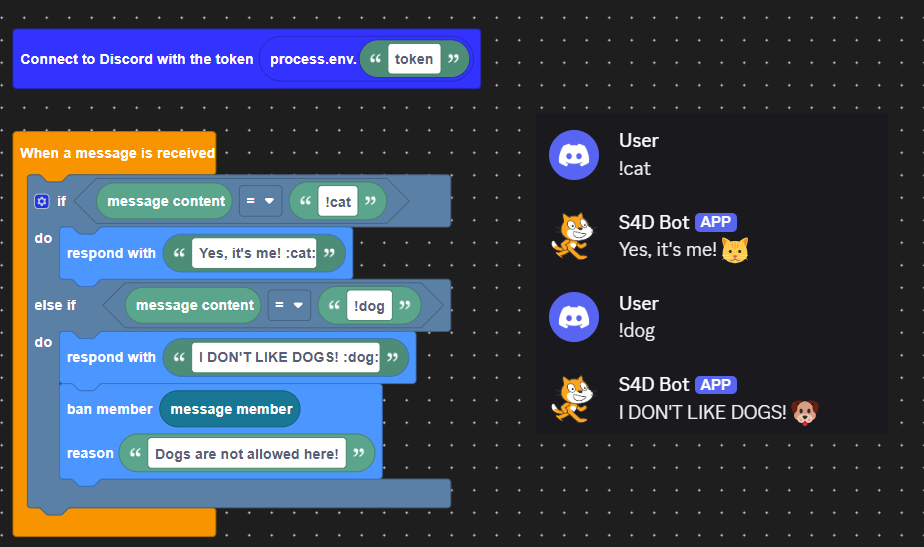
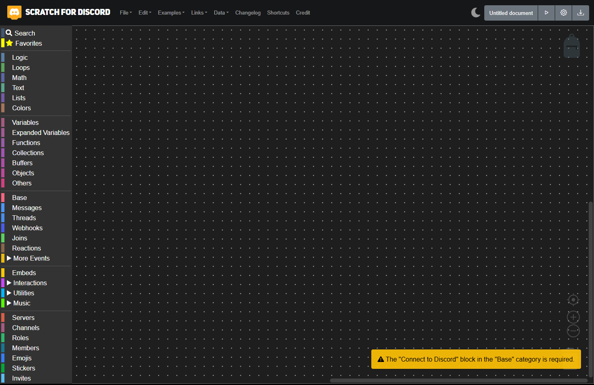

# Scratch For Discord (S4D)

🐱 Make your Discord bot using Scratch blocks! [Scratch For Discord](https://scratch-for-discord.com) is an advanced fork of [discord-blocks](https://discordblocks.leondrolio.com/) and a continuation to the original [469](https://github.com/scratch-for-discord/Web-Application_Frontend/). Thanks to [7coil](https://github.com/7coil) for their great work!

S4D New is forked from [469](https://github.com/scratch-for-discord/Web-Application_Frontend/) and [the original S4D](https://scratch-for-discord.netlify.app) made by Androz2091

- 🖥️ No code knowledge required!
- ⏩ Make a bot in less than 2 minutes!

## How to set up your bot

The discord.js guide has [instructions for setting up a bot application](https://discordjs.guide/legacy/preparations/app-setup). Once you've followed the instructions you can paste the bot token into the "Connect to Discord with token..." block.

## Apps

Not recomended, use web version instead.

- **[Desktop](https://androz2091.github.io/scratch-for-discord/download/index.html)**
- **[Android](https://play.google.com/store/apps/details?id=com.snowflakestudio.scratchfordiscord)**

## Local Installation

To run Scratch For Discord, follow these steps:

- Clone the project: `git clone https://github.com/inventionpro/Web-Application_Frontend/`
- Install dependencies: `yarn install`
- Run dev server: `yarn run dev`
- Finally type `o` and press enter, this will open in the browser.

> [!TIP]
> If you get `Expected ")" but found ";"` press `ctrl + c` to stop it and run again.

## Credits

- Blockly ([RaspberryPiFoundation/blockly](https://github.com/RaspberryPiFoundation/blockly))
- Discord.js ([discordjs/discord.js](https://github.com/discordjs/discord.js))
- Discordblocks ([7coil/discordblocks](https://github.com/7coil/discord-blocks))
- Base from 469 (S4D) ([scratch-for-discord/Web-Application_Frontend](https://github.com/scratch-for-discord/Web-Application_Frontend/))
- The original S4D ([Androz2091/Scratch-For-Discord](https://github.com/Androz2091/scratch-for-discord/))
- Pull request 454 (S4D) ([mrredo-and-josetrindade1/Scratch-For-Discord](https://github.com/mrredo-and-josetrindade1/scratch-for-discord))
- Snowflake107 ([snowflake107](https://github.com/Snowflake107))

### Preview

